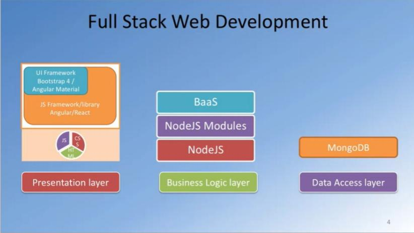

# Angular-Basics

- ng new my-first-project
- cd my-first-project
- ng serve


<b> Databinding - To parse values from ts to html (Input) </b>
```javascript
//server.component.ts => 
import { Component , OnInit ,<b> Input </b>};

// @Input is a decorator , without it element can't be imported
@Input() element : {type:string,name:string,content: string};
// if we use @Input('srvElem') element
// using element is no longer possible , can be imported only using srvElem  => [srvElem]

// app.component.ts  =>
 serverElements = [{type:'server', name:'Server_tomcat' , content: 'For developers only'}];
 //server.component.html =>
 <app-server * ngFor ="let serverElement of serverElements " [element]="serverElements"></app-server>
 <app-server * ngFor ="let serverElement of serverElements " [srvElem]="serverElement"></app-server>
```
<b> 2 way Databinding - To emit event / cache the data passed (Input) </b>
```javascript
// app.component.html =>
<app-cockpit (serverCreated)="onServerAdded($event)"></app-cockpit>

// app.component.ts  =>
onServerAdded(serverData: {serverName:string, serverContent:string}){
this.serverElements.push({
type :'server',
name : serverData.serverName,
content : serverData.serverContent
})

//cockpit.component.ts 
newserverName='';
newserverContent='';
@Output() serverCreated = new EventEmitter<serverName: string , serverContent: string}>();

onAddServer(){
this.serverCreated.emit({
serverName : this.newserverName,
serverContent : this.newserverContent
});
}
```



<b>Course Outline</b>
- Angular material - UI using Angular Components 
- Angular Flex layout - Does exactly the same as Bootstrap - 4 
- Typescript basics 

<b> Module 1 </b>
- Full stack Web Development - The Big Picture
- Intro to Angular
- Angular Components 

<b>Module 2 </b>
- Data binding 
- Angular Service basics 
- Routing 
- SPA

<b> Module 3 </b>
- Angular Template driven forms 
- Angular Reactive forms 
- Angular & Promise 
- Angular & RxJS 

<b> Module 4 </b>
- Client server communication => How angular can ccommunicate with server side and then used to render views 
- Angular & HTTP => How changes will be reflected 
- Angular & REST 
- Animation & Directives  => Attribute & Structural directives 
- Testing Angular Applications
- Building and Deployment 

Resource Materials
- https://tinyurl.com/y5q6gsqp  => About Full stack web 


Then we'll learn about Ionic and NativeScript. 
And then also Server-side development using Node and Node ecosystem.  
